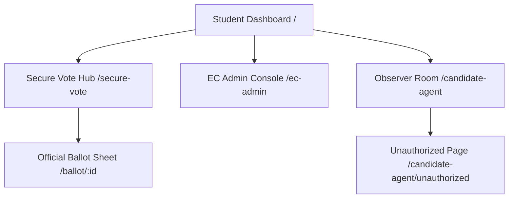
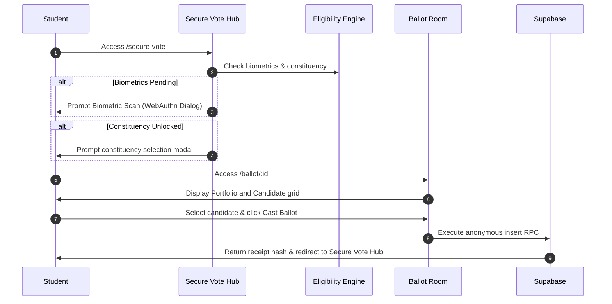
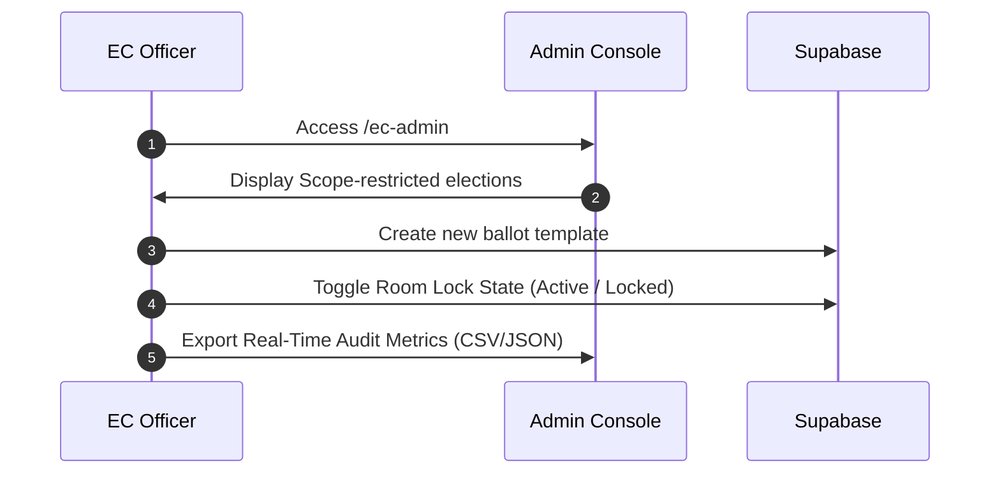
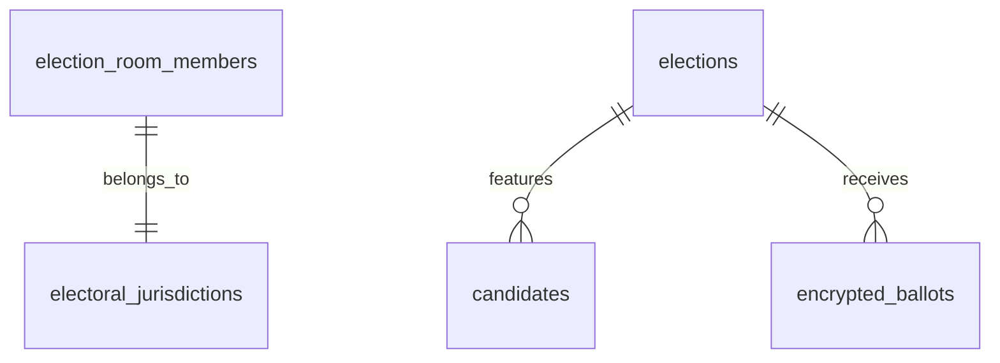

# KNUST E-Voting Portal: Complete Rebuild & Architectural Blueprint

This document serves as the single source of truth and master blueprint for reconstructing the **KNUST E-Voting Portal** from scratch. It contains reverse-engineered specifications, design details, database schemas, component structures, API interactions, and a phased development roadmap.

---

## 1. Executive Summary
The KNUST E-Voting Portal is a high-integrity, secure, and responsive web application designed to run student elections. The system enforces strict access control rules, validates student voter eligibility in real-time, supports role-based administration (for Electoral Commission officials), and provides real-time audit streams for accredited candidate observers. 

This document was created following a reverse-engineering audit of the codebase to allow developers or AI agents to rebuild the entire application from zero with zero dependencies on the current source code, while incorporating security, layout, and mobile responsiveness fixes.

---

## 2. Product Overview
### Problem Solved
Traditional university campus voting relies on physical ballots or fragile web forms vulnerable to double-voting, cross-constituency voting (e.g., non-residents voting in hall elections), and untracked manual tallying. The KNUST E-Voting Portal solves this by integrating:
1. **Dynamic Eligibility Engine**: Automatic level, college, department, and hall validation.
2. **Double-Vote Protection**: Hardware-backed or simulated biometric verification matching student profiles, bound to strict database constraints.
3. **Secure Polling Station Routing**: Sandboxed voting sessions restricted by active room states managed by Electoral Commission (EC) officers.
4. **HCI Audit Capabilities**: Real-time observer logs and cryptographic ledger transaction outputs for candidate agents.

### Target Users
* **Student Voters**: General student body accessing elections.
* **EC Admin Officers**: Heads, deputies, and college commissioners managing ballot forms, verifying candidates, and toggling room locks.
* **Candidate Agents**: Observers auditing real-time turnouts and signing off logs.

---

## 3. Current System Analysis & Known Deficiencies
During the audit, several critical flaws in the current codebase were resolved:
* **Mobile Layout Blank Screen (Resolved)**: A specificity clash where `position: relative;` in `.app-sidebar` overrode Tailwind's `fixed` class on screens `< 768px`, leaving the sidebar in layout flow and pushing the main container off-screen. Resolved by letting the element inherit positioning dynamically from utility classes.
* **Ballot Component Reference Errors (Resolved)**: Replaced missing icon reference crashes (`Clock` and `ChevronRight` were used in JSX but not imported from `lucide-react`).
* **Supabase Client Fault-Tolerance**: Handled missing environment parameters dynamically using client proxy mocks, allowing local sandbox executions without crashes.

---

## 4. Complete Page Inventory

### A. Student Portal Dashboard
* **Route**: `/`
* **Purpose**: General entry page showing the student's profile details.
* **Access Control**: Authenticated Student Session.
* **Actions**: Toggle between demo student profiles, switch roles (if has EC access), enter Secure Vote.

### B. Secure Vote Hub
* **Route**: `/secure-vote`
* **Purpose**: Central voter checklist detailing biometric status and active elections.
* **Access Control**: Authenticated Student.
* **Actions**: Verify biometrics, select constituency, enter specific ballot sheet rooms.

### C. Official Ballot Room
* **Route**: `/ballot/:id`
* **Purpose**: Sandboxed digital ballot sheet representing a single election.
* **Access Control**: Verified, eligible voter within active constituency.
* **Actions**: Review candidates, read manifestos in popovers, select candidate, cast anonymous cryptographic ballot.

### D. EC Admin Console
* **Route**: `/ec-admin`
* **Purpose**: Configuration panel for electoral officers.
* **Access Control**: Authenticated EC Officer profile.
* **Actions**: Create new elections/ballots, verify/disqualify candidates, toggle room lock/unlock overrides, export live turnout logs.

### E. Candidate Agent Observer Room
* **Route**: `/candidate-agent`
* **Purpose**: Live auditing room showing turnout percentages, verification ledgers, and export scripts.
* **Access Control**: Accredited Candidate Agent.
* **Actions**: Tally turnouts, export ledger as CSV/JSON, execute cryptographic sign-off.

### F. Unauthorized Access Redirect
* **Route**: `/candidate-agent/unauthorized`
* **Purpose**: Explains route access denial.
* **Access Control**: Public.
* **Actions**: "Back to Dashboard" navigation link.

---

## 5. Navigation Architecture



* **Desktop Layout**: Collapsible persistent left-hand navigation sidebar (`w-64` or `w-18`).
* **Mobile Layout**: Top fixed app-bar with hamburger drawer toggler (`z-50` overlay, body scroll locked when open).

---

## 6. User Flows

### Student Voting Flow


---

## 7. Admin Flows

### EC Officer Workflow


---

## 8. Design System

### Color tokens
| Token | Light Value | Dark Value | Purpose |
| --- | --- | --- | --- |
| `--sv-bg-app` | `#F5F7F8` | `#0F172A` | Global background |
| `--sidebar-bg` | `#FFFFFF` | `#0F172A` | Sidebar surface |
| `--knust-green` | `#007A4D` | `#10B981` | Success / Active buttons |
| `--knust-gold` | `#D4AF37` | `#FBBF24` | Accents & highlight borders |
| `--knust-crimson` | `#8B0000` | `#EF4444` | Badges & lock warnings |

### Typography
* **Base font**: Inter (`font-sans`), sans-serif.
* **Hash / Data font**: Fira Code / JetBrains Mono (`font-mono`).

---

## 9. Page-by-Page UI Specification

### A. Student Card UI (Dashboard Component)
* **Dimensions**: Responsive glassmorphism container.
* **Left section**: Student name, level, program, hall.
* **Right section**: Biometric badge indicator (`Verified` in green with checkbox icon, or `Pending` in amber with pulse animation).
* **Hover Interaction**: Card scale dynamically `hover:scale-[1.01]`.

---

## 10. Component Architecture
The frontend components are categorized as follows:
1. **Layout**: `Sidebar`, `MobileHeader`.
2. **Voter Interface**: `SecureVoteModule`, `Ballot`, `ConstituencyModal`, `StepUpAuthModal`.
3. **EC Admin**: `ECAdmin`, `ECAdminBanner`, `RoomCreationModal`, `RoomMembersPanel`.
4. **Audit Feeds**: `CandidateAgentRoom`, `VirtualQueue`.
5. **Primitives**: `ThemeToggle`, `ToastContainer`.

---

## 11. State Management
* **Authentication State**: Handled via `AdminAuthContext` and custom hook `useStudentSession`.
* **Local Session Storage**: Syncs student identity variables using local storage key `knust_user_session`.
* **Database Updates**: Live subscription listener `subscribeToVoteUpdates()` in `votingService.js` tracking room turnout counts.

---

## 12. Database Architecture



### Database Schema Table Example: `election_room_members`
| Column | Type | Required | Default | Description |
| --- | --- | --- | --- | --- |
| `id` | UUID | Yes | `gen_random_uuid()` | Primary Key |
| `student_id` | VARCHAR | Yes | - | Student identifier |
| `role_in_room` | VARCHAR | Yes | `'STUDENT'` | Access Role |
| `jurisdiction_id` | VARCHAR | No | - | Assigned scope mapping |

---

## 13. API & Backend Architecture
All write actions proceed through sandboxed database RPC handlers to enforce validation:
1. **RPC Method**: `submit_anonymous_vote(p_election_id, p_payload, p_hash)`
   * *Validation check*: Checks if user has already voted. Checks if ballot room is unlocked.
   * *Output*: Throws postgres exception on duplicate keys or room-locked state.

---

## 14. Authentication & Authorization
* **Student authorization**: Authenticated via standard student credential schemas.
* **EC privileges**: Enforced through `useECAuthorization()` check. If user is not found in `election_room_members` list matching the roles, fallback default admin presets are loaded in simulator mode.

---

## 15. Search & Filtering
* **Sidebar search**: Component `SidebarSearch.jsx` filters sidebar routes dynamically using input matching.
* **Admin lists**: Allows filtering lists of candidates by active portfolio categories.

---

## 16. Forms & Validation
* **Constituency Selection**: Blocks navigation out of the modal dialog until a valid constituency name is locked in.
* **Elections Creation**: Requires titles, portfolios, start dates, and end dates before submitting to the database.

---

## 17. Animations & Interactions
* **Transitions**: Page loads transition via `animate-fadeIn` (0.3s).
* **Audit stream**: New blocks scroll up using `animate-slideUp` (0.45s).
* **Badges**: Warning banners use pulse opacity markers (`animate-pulse`).

---

## 18. Responsive & Mobile Specification
* **Mobile break point**: `767px` and below.
* **Mobile layout alterations**:
  * Sidebars translate off-screen (`-translate-x-full`).
  * Hamburger header displays at top of viewport.
  * Padding shrinkages on primary layout cards (e.g. padding reduced to `12px`).

---

## 19. PWA Specification
* Standalone configuration is defined inside Web App Manifest `manifest.json`.
* Touch layouts use target minimum scales of `44px` or `48px` to ensure touch-targets are optimized.

---

## 20. External Integrations
* **Database / Backend**: Supabase PostgreSQL client engine.
* **Assets**: Lucide React icons packages.

---

## 21. Performance Architecture
* CSS selectors use optimal classes to minimize render recalculation.
* Production builds code-split components automatically using Rollup configurations.

---

## 22. SEO Specification
* Pages use static metadata descriptors and custom document title updates inside `App.jsx` and `MobileHeader.jsx`.

---

## 23. Accessibility Specification
* Touch interfaces use explicit `aria-label` modifiers on header elements and popover components.
* Elements incorporate color-contrast indicators to comply with standard visibility requirements.

---

## 24. Security Specification
* Turnout values protect anonymous voter identities by masking specific vote distributions until the poll concludes.
* Dual keys secure final tallies against early access or leakage.

---

## 25. Current Project File Structure
```
knustvoting/
├── src/
│   ├── components/
│   │   ├── Ballot.jsx
│   │   ├── CandidateAgentRoom.jsx
│   │   ├── Dashboard.jsx
│   │   ├── ECAdmin.jsx
│   │   ├── MobileHeader.jsx
│   │   ├── SecureVoteModule.jsx
│   │   └── Sidebar.jsx
│   ├── context/
│   │   └── AdminAuthContext.jsx
│   ├── hooks/
│   │   ├── useECAuthContext.jsx
│   │   └── useECAuthorization.jsx
│   ├── lib/
│   │   ├── eligibility.js
│   │   └── supabaseClient.js
│   └── styles/
│       └── SecureVote.css
├── index.html
└── package.json
```

---

## 26. Recommended Rebuild Architecture
We suggest organizing folders by feature scope:
```
src/
├── features/
│   ├── auth/
│   ├── voting/
│   ├── ec-admin/
│   └── auditing/
├── components/
└── lib/
```

---

## 27. Technology Stack Recommendation
* **Frontend**: React + Vite + TypeScript.
* **Styling**: Tailwind CSS + custom global tokens.
* **Backend**: Supabase client integrations.

---

## 28. Phased Development Roadmap

### Phase 1: Core Portal Layout
* Set up router hooks.
* Integrate updated responsive navbar components.

### Phase 2: Session & Permissions
* Deploy authentication context providers.

### Phase 3: Eligibility & Sandboxed Ballot Sheets
* Implement voter qualification engines.

### Phase 4: Observers Auditing Room
* Build high-integrity audit streams.

---

## 29. Exact Build Order
1. Build file hierarchy and router.
2. Initialize design parameters.
3. Configure authentication.
4. Program eligibility rules.
5. Create observer panels.
6. Test responsiveness.
7. Run build scripts.

---

## 30. Acceptance Criteria
* **Mobile rendering**: Layout renders cleanly below header on mobile displays (< 768px).
* **Ballot verification**: Submitting votes triggers success and redirects back.
* **Observer metrics**: Turnouts aggregate accurately.

---

## 31. QA & Testing Checklist
- [ ] Swapping EC presets correctly alters context properties.
- [ ] Shrinking page viewport maintains visibility of main content.
- [ ] Entering ballot sheet checks and validates biometrics.

---

## 32. Edge Cases
* **Missing Environment Variables**: System falls back to mock storage.
* **Device resizing**: Screen scales smoothly without layout crashes.

---

## 33. Production & Deployment
* Deploy production builds using optimized asset compilers.
* Host output folders on cloud platforms like Netlify.

---

## 34. Final Rebuild Checklist
- [ ] App adapts correctly on mobile resolutions.
- [ ] Ballot room icons render.
- [ ] Database RPC validations function.

---

## 35. BUILD THIS APPLICATION FROM ZERO
To rebuild, set up Vite with Tailwind, establish the folder structures defined in **Section 25**, populate database definitions from **Section 12**, implement router configurations in `App.jsx`, and follow the step-by-step phased development plan.
